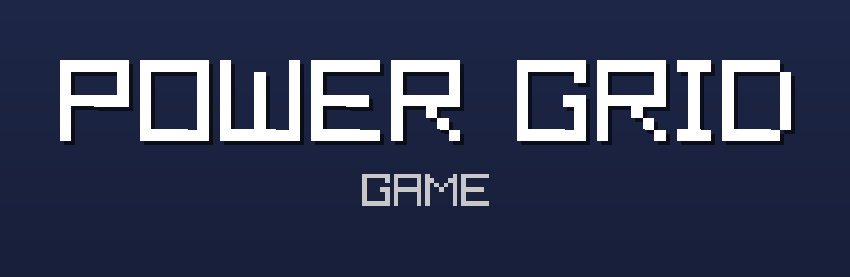

# The Power Grid Game

A game about controlling and stabilizing the power grid. Manage different power plants, keep supply and demand in balance, and grow your grid by buying new plants.

## How it works

- Each slot holds a power plant (or is empty and can be bought).
- Solar, wind, and water plants generate power automatically based on conditions (e.g. time of day for solar).
- Coal and nuclear plants can be regulated with a slider to set their target output.
- Pump and battery storage can be charged, discharged, or set to auto mode to automatically balance surplus/deficit in the grid.
- The gauge at the bottom shows grid stability. Keep it centered to keep users happy and earn money.
- The graph shows demand vs. generation over time.
- The bar on the bottom left shows the current time of day and whether it's day or night (affects solar output).
- Earn money based on how well the grid is supplied and how stable it is, then use it to buy more plants.
- Press **ESC** to open the menu, where you can save and load your game.
- Click on a plant directly to access a menu to upgrade or sell it.

## Compatibility

- Built in C using [raylib](https://www.raylib.com/) and [raygui](https://github.com/raysan5/raygui)
- Windows (tested with MinGW/CLion)
- Should also build on Linux/macOS with raylib installed, though this hasn't been tested
- Optimized for 1080p 16:9 displays, although it should work with other resolutions or ratios as well

## How to run

1. Download the latest `.exe`
2. Just run it. No installation required.
3. If a Microsoft Antivirus popup shows up, just ignore it. I promise I didn't include any virus 🤣
4. Have a great time

## Credits

All included pictures are from flaticon.com:

<a href="https://www.flaticon.com/free-icons/no-power" title="no power icons">No power icons created by kawalanicon - Flaticon</a>,
<a href="https://www.flaticon.com/free-icons/solar" title="solar icons">Solar icons created by Magnific - Flaticon</a>,
<a href="https://www.flaticon.com/free-icons/wind-turbine" title="wind turbine icons">Wind turbine icons created by Iconic Artisan - Flaticon</a>,
<a href="https://www.flaticon.com/free-icons/water-energy" title="water energy icons">Water energy icons created by FACH - Flaticon</a>,
<a href="https://www.flaticon.com/free-icons/coal" title="coal icons">Coal icons created by Magnific - Flaticon</a>,
<a href="https://www.flaticon.com/free-icons/nuclear" title="nuclear icons">Nuclear icons created by Magnific - Flaticon</a>,
<a href="https://www.flaticon.com/free-icons/battery" title="battery icons">Battery icons created by Magnific - Flaticon</a>,
<a href="https://www.flaticon.com/free-icons/hydropower" title="hydropower icons">Hydropower icons created by IYIKON - Flaticon</a>,
<a href="https://www.flaticon.com/free-icons/lightning" title="lightning icons">Lightning icons created by Magnific - Flaticon</a>
